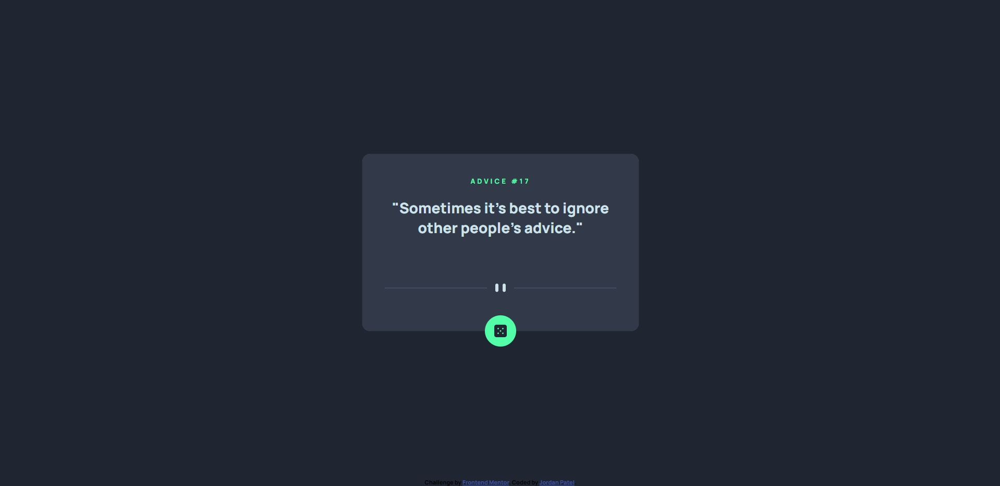

# Frontend Mentor - Advice generator app solution

This is a solution to the [Advice generator app challenge on Frontend Mentor](https://www.frontendmentor.io/challenges/advice-generator-app-QdUG-13db). Frontend Mentor challenges help you improve your coding skills by building realistic projects.

Difficulty: Level 2 (Junior)

## Overview

### The challenge

Users should be able to:

- Desktop only
- See hover states for all interactive elements on the page
- Generate a new piece of advice by clicking the dice icon

### Links

- Live Site URL: [https://jordansgit.github.io/advice-generator-app/](https://jordansgit.github.io/advice-generator-app/)

### Built with

- HTML5 
- CSS 
- JavaScript
- Advice Slip API

### Screenshot

Desktop 

